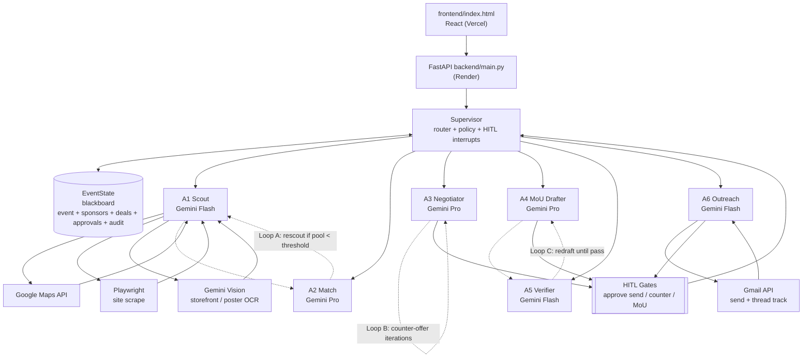

# Paytriq — Design Document

## 1. Overview

**Paytriq** is a Campus Sponsorship Dealmaker: an autonomous 6-agent mesh that takes a student event (fest, hackathon, sports meet) and closes local sponsorships — discovering shops via Maps, scoring fit, negotiating offers, drafting MoUs, verifying compliance, and sending Gmail outreach under human approval.

Target user: college event coordinators / sponsorship cells who currently cold-mail shops manually and lose weeks to follow-ups.

## 2. Architecture Diagram

Directions: UI → API → Supervisor → agents (one-way dispatch); Supervisor ↔ EventState (bidirectional blackboard); agents → tools → agents (request/response); HITL → Supervisor (gate release). Loops A/B/C are supervisor-enforced conditional edges, not direct agent calls.

## 3. Agent Roles

| Agent | Role | Input (from EventState) | Tools | Output (to EventState) | Memory |
|-------|------|-------------------------|-------|------------------------|--------|
| A1 Scout (Flash) | Discover candidate sponsors near campus | event location, radius, category, keywords | Maps, Playwright, Vision | `sponsors[]` {name, address, contact, source} | Writes raw candidates; no long-term memory |
| A2 Match (Pro) | Score sponsor ↔ event fit | `sponsors[]`, event footfall/budget/audience | Gemini Pro reasoning, deal-history lookup | `ranked_sponsors[]` {fit_score, reasons} | Reads long-term deal history (Supabase/JSON) for priors |
| A3 Negotiator (Pro) | Generate offers, evaluate counters | ranked sponsor, budget bands, prior counters | Gemini Pro, pricing policy | `offer{v1..vn}`, `counter_analysis` | Appends to `negotiation_trace[]` per sponsor |
| A4 MoU Drafter (Pro) | Draft MoU from approved terms | approved offer, event + sponsor details, template | Gemini Pro, MoU template | `mou_draft{markdown/pdf}` | Stores `mou_versions[]` |
| A5 Verifier (Flash) | Compliance + grounding check | `mou_draft`, `offer`, policy rules | Rules engine + Flash self-check | `verification{pass/fail, issues[]}` | Writes `audit[]`; stateless across events |
| A6 Outreach (Flash) | Send approved emails, track replies | approved payload, Gmail thread ID | Gmail API | `outreach_log[]`, `reply_status` | Updates thread state in EventState |

Model split rationale: Pro for A2/A3/A4 (reasoning, scoring, drafting quality); Flash for A1/A5/A6 (high-volume, latency-sensitive, low-cost extraction/classification/verification).

## 4. Orchestration Pattern

**Pattern: supervisor-worker + blackboard.**

- **Supervisor** owns routing, policy, and interrupts. Workers (A1–A6) never call each other; they read inputs from `EventState` and write outputs back. Supervisor evaluates conditional edges after each node.
- **Blackboard (`EventState`)** is the single source of truth: `{event, sponsors, ranked_sponsors, offers, mou_versions, verification, approvals, outreach_log, audit}`. Every transition appends to `audit[]`.
- **Conditional edges:**
  - If `len(ranked_sponsors with fit ≥ 0.6) < 3` → Loop A: re-dispatch A1 with expanded radius/keywords (max 2 retries).
  - If counter received and within budget band → Loop B: re-dispatch A3 with counter context (max 3 rounds, then escalate to human).
  - If `verification.pass == false` → Loop C: re-dispatch A4 with `issues[]` (max 2 redrafts, then human review).
- **Interrupts + HITL gates:** three hard gates enforced by Supervisor before any side effect:
  1. Approve before **send** (A6 cannot call Gmail without `approvals.send == approved`).
  2. Approve before **counter** (A3 counter-offers above floor need approval).
  3. Approve before **MoU** sign-off (A4 final draft needs approval; `/api/approvals` records approver + timestamp).
  Pending actions return `status: pending_approval`; Supervisor blocks downstream nodes until resolved.
- **Justification vs peer-to-peer:** peer-to-peer (agents calling agents) was rejected because it hides state, duplicates memory, complicates HITL, and makes audit/debugging hard. Supervisor-worker + blackboard gives one auditable trail, one place for HITL enforcement, deterministic replay via `EventState` snapshots, and trivial unit testing of each node in isolation (`pytest`).

Custom lightweight graph runtime mirrors LangGraph semantics (node functions, edge predicates, `interrupt()` on HITL) without LangGraph Server / LangSmith infra cost.

## 5. Tech Choices

| Layer | Choice | Justification |
|-------|--------|---------------|
| Frontend | React (static `frontend/index.html` prototype), deploy Vercel | Zero-backend demo, fast iteration; upgrade path to full React build |
| Backend | FastAPI (`backend/main.py`), deploy Render | Async, auto-OpenAPI docs, simple Gmail/Maps integration |
| Persistence | Supabase (Postgres), optional JSON fallback | Supabase for hosted deal history; JSON file fallback keeps local demo + tests offline-capable, zero cost |
| LLM — reasoning | Gemini Pro for A2/A3/A4 | Best quality for fit scoring, negotiation reasoning, MoU drafting |
| LLM — fast | Gemini Flash for A1/A5/A6 | Low latency/cost for extraction, verification, outreach templating |
| Discovery | Google Maps API | Ground-truth local sponsors (name, location, contact) |
| Outreach | Gmail API | Real send + thread tracking; dry-run mode for demo without creds |
| Scraping | Playwright | JS-rendered shop sites / directories Maps misses |
| Grounding | Gemini Vision | Storefront/poster OCR to verify sponsor category and reduce hallucinations |
| Orchestration | Custom lightweight graph runtime (LangGraph-mirroring) | Nodes + conditional edges + interrupts with no infra cost; full control of HITL gates |

## 6. Failure Handling + Robustness

| Failure | Mitigation |
|---------|------------|
| LLM hallucinated sponsor / term | A5 Verifier cross-checks against Maps/Playwright evidence; Loop C redraft; unverified drafts never send |
| Maps quota / offline | JSON sponsor-cache fallback; A1 degrades to Playwright + cache |
| Gmail auth failure | Dry-run mode logs payload to `outreach_log[]`; `/api/outreach/send` returns `dry_run: true` |
| Empty / low-fit pool | Loop A rescout (max 2); else Supervisor returns "expand radius or lower threshold" to UI |
| Endless negotiation | Loop B capped at 3 rounds → escalate to HITL human |
| Verification loop non-convergence | Loop C capped at 2 redrafts → human review queue |
| Partial crash | `EventState` snapshotted after every node; resume via `GET /api/events/{id}`; `audit[]` enables replay |
| Prompt injection in scraped pages | Playwright output sanitized; A5 strips non-allowlisted fields before MoU/send |

All side-effecting routes are idempotent (client-supplied `idempotency_key`) and gated by `/api/approvals` audit entries.
